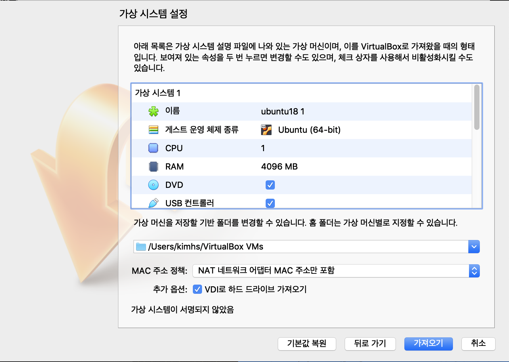
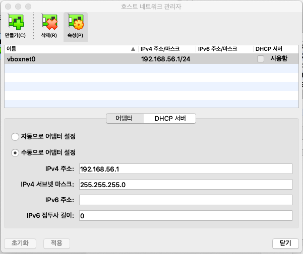
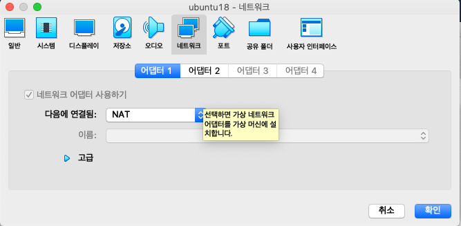
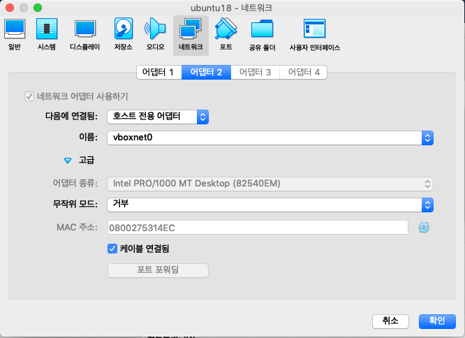

# 비트코인

## 1. HandsOn 소개

Linux(Ubuntu)상에서 Bitcoin Daemon을 설치하고 각 단계별 실습을 통해 Bitcoin의 동작원리를 알아본다.

<br><br>
## 2. 실습순서
 - VirtualBox 설치 및 환경 설정
 - 비트코인 설치(RegTest)
 - 비트코인 실습(bitcoin-qt, bitcoind, bitcoin-cli)

<br><br>
## 3. 준비환경
 - 개인 Desktop 준비
 - (Optional) Putty(윈도우 사용자) / iterm(Mac 사용자<br>
 - (Optional) FileZilla
 - VirtualBox 설치 및 환경 설정
 - Linux OS(Ubuntu 18.04.2 LTS) 설치
<br><br>


<br><br>
## 4. 시작하기
### 4.1 VirtualBox 설치 및 환경 설정

### **[사전에 준비된 linux(ova)을 다운받아주세요]**
https://drive.google.com/file/d/13MGMJr56nMUQM--cSdTQziwt6UAugAja/view?usp=sharing
<br><br>

1. https://www.virtualbox.org/wiki/Downloads 접속 후 OS에 맞는 SW 다운로드/설치
2. Virtual Box 실행
3. 메뉴 > 파일 > 가상시스템가져오기
4. ubuntu18.ova 파일 선택
5. 아래와 같이 설정

---

6. 메뉴 > 파일 > 호스트 네트워크 관리자 > 만들기

---
7. 메인 > Linux 이미지 클릭 >  네트워크 > 호스트 전용 어댑터 클릭
8. Linux 이미지 클릭 > 설정 > 네트워크 > 어댑터 1 > NAT 클릭

---
9. Linux 이미지 클릭 > 설정 > 네트워크 > 어댑터 2 > HOST전용어댑터 클릭

---

10. Linux 접속
11. network 설정


```
$) sudo vi /etc/network/interfaces

auto lo
iface lo inet loopback

auto enp0s8 #host only adap
iface enp0s8 inet static
address 192.168.56.10
netmask 255.255.255.0

$) sudo systemctl restart network
```
<br><br>
### **4.2. putty 설치(Desktop)**
- 용도 : 서버 접속
1. https://www.chiark.greenend.org.uk/~sgtatham/putty/latest.html 접속
2. putty.exe 다운로드 설치
<br><br>

### **4.3. golang 설치(Desktop)**
- 용도 : chaincode 개발
1. https://golang.org/dl/ 접속
2. go.1.12.5.window-amd64.msi 다운로드
3. install
<br><br>

<br><br>

### **4.4 비트코인 Core 다운로드**
- Ubuntu 접속
- FireFox 브라우저 열기
- https://bitcoin.org/en/download 접속
- Linux용 Bitcoin Core 다운로드
```
위 방법이 안될 경우
$) curl -O https://bitcoin.org/bin/bitcoin-core-0.18.1/bitcoin-0.18.1-x86_64-linux-gnu.tar.gz
```
<br>

### **4.5 비트코인 Core 압축풀기**
```
$) tar -xvzf bitcoin-0.18.1-x86_64-linux-gnu.tar.gz
```
<br>

### **4.6 비트코인 실행을 위한 권한 설정 및 절대경로 지정**
```
$) sudo install -m 0755 -o root -g root -t /usr/local/bin bitcoin-0.18.1/bin/*
```
<br>

### **4.7 비트코인 실행하기**
 - bitcoin-qt 또는 bitcoind를 이용해 비트코인 네트워크를 구동

<br><br>

#### 4.7.1 bitcoin-qt :  크로스 플랫폼 애플리케이션 / GUI Interface 무료 툴킷<br>
```
$)./bitcoin-qt
```

#### 4.7.2 bitcoind : 개발자 및 운영자를 위한 블록체인 네트워크
- bitcoin 서비스 켜기(운영망)
```
$) bitcoind -daemon
```

- bitcoin 서비스 확인
```
$) ps -ef | grep bitcoin
$) netstat -anp | grep 8332
$) watch -n 1 du .bitcoin
```

- bitcoin 서비스 중지
```
$) bitcoin-cli stop
```
<br><br>

## 잠깐! 비트코인은 어디에 연결되어 블록을 받아오는 것일까?
```
https://github.com/bitcoin/bitcoin/blob/4b51ed89cfce9870a20d75001fae3b68ac1dfd86/src/chainparams.cpp

1. Seed 서버가 랜덤으로 Node IP(Public) 제공(IP가 변경되는 주기는 몇초 이상) 
$) dig seed.bitcoinstats.com +short

2. 오프라인일 경우 캐쉬
```
<br><br>

## 비트코인 노드의 위치를 확인하기
https://bitnodes.earn.com/#join-the-network

<br><br>

## 비트코인 MainNet을 현실적으로 검증하기 어려운 이유
- 약 200GB에 해당하는 디스크 용량 필요
- Transaction을 발생시키기 위한 MainNet 비트코인 보유 필수
  (현재 비트코인은 얼마?)

<br><br>

## 다른 대안은?
- bitcoind -testnet -daemon
- bitcoin-cli -testnet getblockchaininfo
- bitcoind -regtest -daemon
- bitcoin-cli -regtest getblockchaininfo


<br><br>
## 5. Getting Started(regTest)

### 5.1. 비트코인 코어 데몬 실행
```
$)./bitcoind -regtest -daemon -deprecatedrpc=signrawtransaction
```
※ 응답값 : Bitcoin server starting (STOP : ./bitcoin-cli -regtest stop)


<br><br>

### 5.2 블록생성(regtestMode에서만 가능)
 
```
$)./bitcoin-cli -regtest generate 101
$)./bitcoin-cli -regtest getbalance
$)./bitcoin-cli -regtest listaddressgroupings
```
※ regtest모드에서는 최초 150블록에만 
   reward BitCoin은 100컨펌을 기다려야 하기 때문에 101번째

<br><br>

### 5.3 블록데이타 위치

```
$)cd .../Application Support/Bitcoin/regtest
```

<br><br>

### 5.4 new Address 생성
 
```
$)./bitcoin-cli -regtest getnewaddress
$)NEW_ADDRESS=응답값
```
※ 응답값 : 비트코인 주소


<br><br>

### 5.5 transaction 발생 후 밸런스 체크
```
$)./bitcoin-cli -regtest sendtoaddress $NEW_ADDRESS 10.00
$)./bitcoin-cli -regtest getbalance
```

<br><br>
 
### 5.6 transaction 후 조회
```
$)./bitcoin-cli -regtest listunspent 0
```
※ 응답값 : 동일한 transactionID로 vout이 2개있음(array처럼 순서가 있으므로 vector라는 이름씀 v)
                confirmation 확인

<br><br>

### 5.7 블록 만들어 보기
```
$)./bitcoin-cli -regtest generate 1
$)./bitcoin-cli -regtest listunspent 0
$)UTXO_TXID = Coinbase Transaction ID
$)UTXO_VOUT = 0 
```
이상함
※ 응답값 : confirmation 확인

<br><br>

### 5.8 새로운 어드레스 만들기

```
$)./bitcoin-cli -regtest getnewaddress
$)NEW_ADDRESS=응답값
$)./bitcoin-cli -regtest getreceivedbyaddress $NEW_ADDRESS
```


<br><br>


### 5.9 RAW TRANSACTION 만들기

```
$)./bitcoin-cli -regtest createrawtransaction '''
    [
      {
        "txid": "'$UTXO_TXID'",
        "vout": '$UTXO_VOUT'
      }
    ]
    ''' '''
    {
      "'$NEW_ADDRESS'": 49.9999
    }'''
$)RAW_TX=위 명령어 응답값(ex : 02000000014d586994365b7641e19f8e16edc5b6a2b41650b38f582f90d9e97cafe72845700000000000ffffffff01f0ca052a0100000017a914bcea2054333005b097526b0f56c35385ef8052948700000000)
```
※ 어떤 UTXO를 사용할 건지(TrxID, index)와 보낼 주소 필요
 
<br><br>

### 5.10 RAW TRANSACTION DECODE 해보기(UTXO)

```
$) bitcoin-cli -regtest decoderawtransaction $RAW_TX
```

<br><br>

### 5.11 RAW TRANSACTION에 싸인하기

```
$) ./bitcoin-cli -regtest signrawtransaction $RAW_TX
$) SIGNED_RAW_TX=응답값
```

<br><br>


### 5.12. SIGNED_RAW TRANSACTION 보내기

```
$) ./bitcoin-cli -regtest sendrawtransaction $SIGNED_RAW_TX
```

<br><br>

### 5.13 MemPool에 있는 TRANSACTION 확인하기
```
$)./bitcoin-cli -regtest getrawmempool
```


<br><br>


## 6. 시작하기(TestNet)
### 6.1 bitcoin generator(address)
- https://bitcoinpaperwallet.com/bitcoinpaperwallet/generate-wallet.html?design=alt-testnet


<br><br>

### 6.2 bitcoin testnet 충전하기
- https://coinfaucet.eu/en/btc-testnet/
- http://tpfaucet.appspot.com/


<br><br>

### 6.3 bitcoin testnet 확인
- https://testnet.blockchain.info/address/


